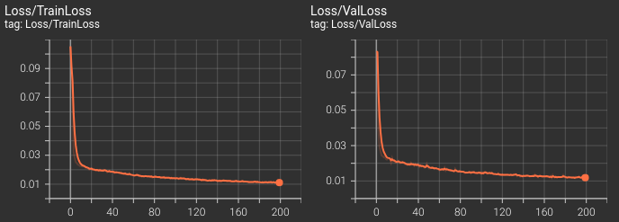
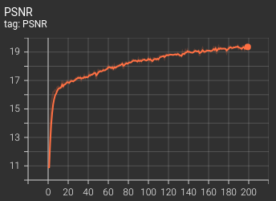
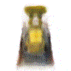

# Seeing Beyond the Frames!
It's a fascinating idea that we can reconstruct an entire scene given a set of views, and in this project we explore two such ways: one is the classical Structure from Motion (SfM) and the other is the learning-based Neural Radiance Fields (NeRF).

## Phase I: Structure from Motion (SfM)
Structure from motion helps reconstruct a scene from two or more different views using epipolar geometry. A few years ago, Agarwal et. al published Building Rome in a Day in which they reconstructed the entire city just by using a large collection of photos from the internet. In this phase, we take a detailed step-by-step approach from feature matching to obtaining camera locations to reconstructing the scene.

## Phase II: Neural Radiance Fields (NeRF)
Neural Radiance Fields (NeRF) is an innovative approach to view synthesis that pushed the boundaries of computer vision and graphics. NeRF's underlying neural network architecture models the radiance and geometry of a scene taking sparse image set and camera poses as inputs, enabling it to generate novel views. In this phase, we build a vanilla NeRF model (with modifications to work on a lighter GPU) from the original paper by Mildenhall et al.

### Running the package
Download the data required for the package (Lego dataset) from [here](https://drive.google.com/drive/folders/1lrDkQanWtTznf48FCaW5lX9ToRdNDF1a).
Since the package has already been downloaded - from the package's root directory, use the following commands for training/inference respectively:
```
python phase2/code/train.py
``` 
```
python phase2/code/test.py
```
Use `--help` argument for further explanation on the arguments.

### Results
This is a brief summary of the results obtained. Details of the training regime, along with the network architecture, are given below:

1. **Dataset**:  Lego Dataset (resized to 100x100)
2. **Optimizer**: Adam optimizer and learning rate of 5e-4
3. **Number of samples per ray**: 64
4. **Mini-batch size**: 5000 (number of query points to be evaluated in one pass)
5. **Near and far planes**: 2.0 - 6.0
6. **Number of encoding frequencies**: 10 position freq, 4 direction freq

Train-Val Loss |                  
:-------------------------:|

*Training and Validation loss over epochs*|

PSNR             |  Result
:-------------------------:|:-------------------------:|
 | 


<!-- ## Acknowledgements

Although significant changes have been made, the code for Phase II of this project was based on / inspired by the starter code provided in WPI's RBE549 (Computer Vision). [This](https://rbe549.github.io/spring2023/hw/hw0/) is the link to their project page. -->


## References:
1. Mildenhall, B., et al. (2020). NeRF: Representing Scenes as Neural Radiance Fields for View Synthesis. In Proceedings of the European Conference on Computer Vision (ECCV).
2. https://www.scratchapixel.com/lessons/3d-basic-rendering/ray-tracing-generating-camera-rays/generating-camera-rays.html
3. https://github.com/yenchenlin/nerf-pytorch
4. https://colab.research.google.com/drive/1TppdSsLz8uKoNwqJqDGg8se8BHQcvg_K?usp=sharing