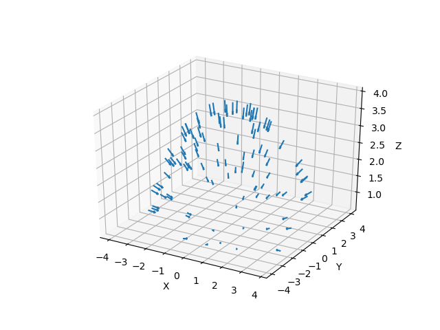

# Notes

MLP network $F_{\theta}: (\textbf{x, d}) \rightarrow (\textbf{c}, \sigma)$, where 
- $\textbf{x}$: 3D location
- $\textbf{d}$: viewing direction represented as 3D cartesian unit vector
- $\textbf{c}$: color (directional emitted radiance)
- $\sigma$: volume density

## NeRF breakdown

### 1. Ray Casting
### 2. Volumetric Sampling
### 3. Obtaining predictions from MLP
### 4. Volume Rendering

## Camera Pose (Dataset) Visualization
Below is a graphic that shows camera poses from the training set.
